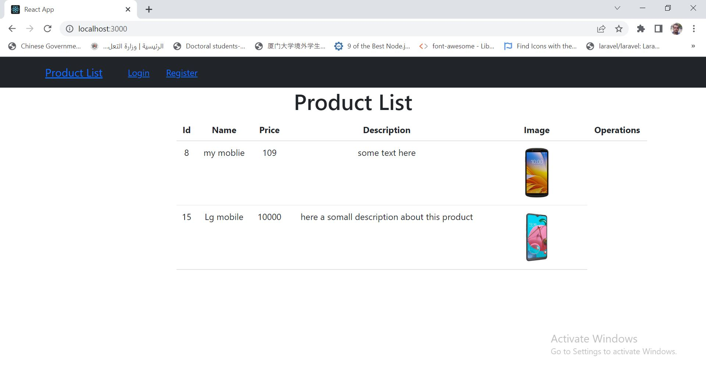
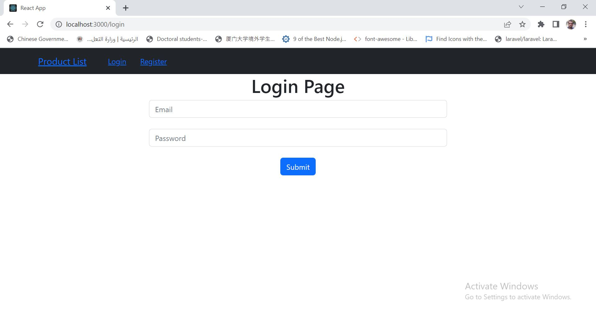
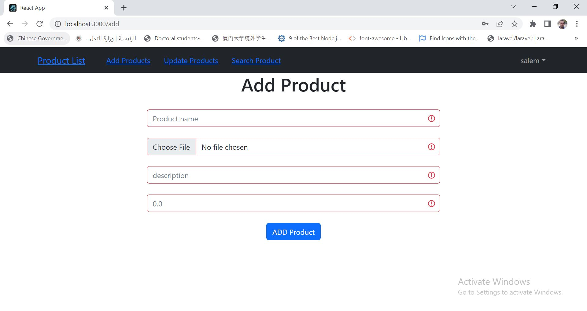
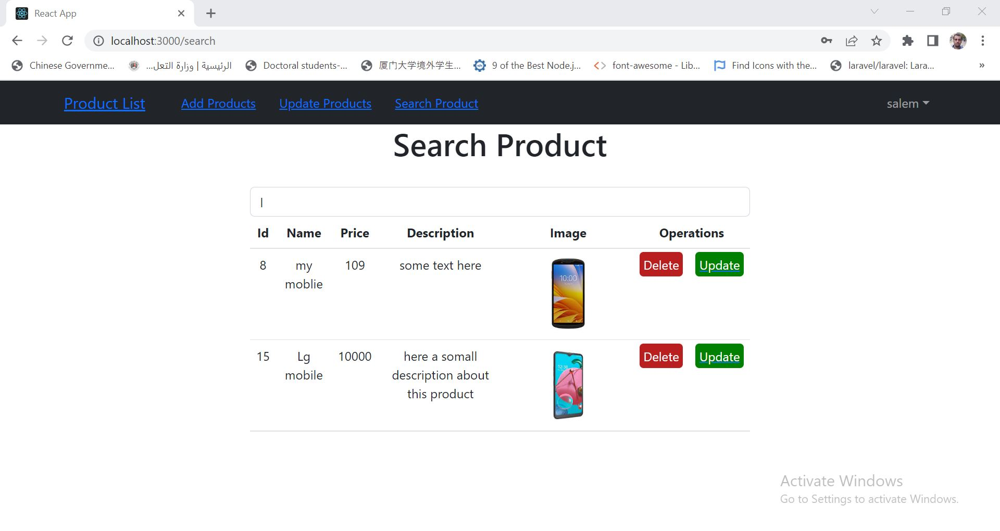

# react-with-laravel-api
This project is  a combination of laravel 9 as backend api with react.js as frontend.
# Screen shots
## Home Page :

## Login page

## Add product Page :

## Search Page :

# To run this example please follow these few steps:

## a. frontend : 
1. install react.js 
npx create-react-app my-react-app
2. install react router 
npm install react-router-dom
3. install react bootstrap 
npm install react-bootstrap bootstrap
4. copy node_modules folder to forntend folder
5. check config.js folder and put your backend server information
6. use cmd to run this command inside frontend folder : npm start

## b. backend :
1. create database with name "ecomm":
then import ecomm.sql file
2. use cmd to run this command inside backend folder : php artisan serve 

finally enjoy it !

